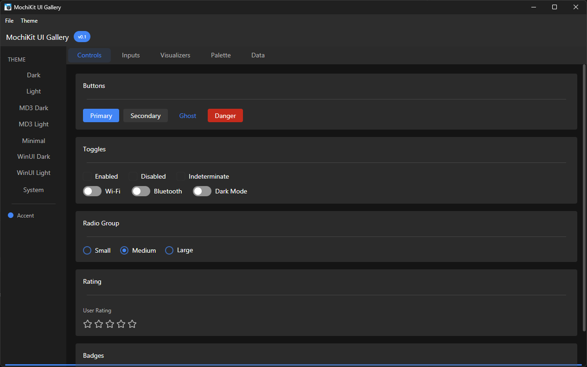
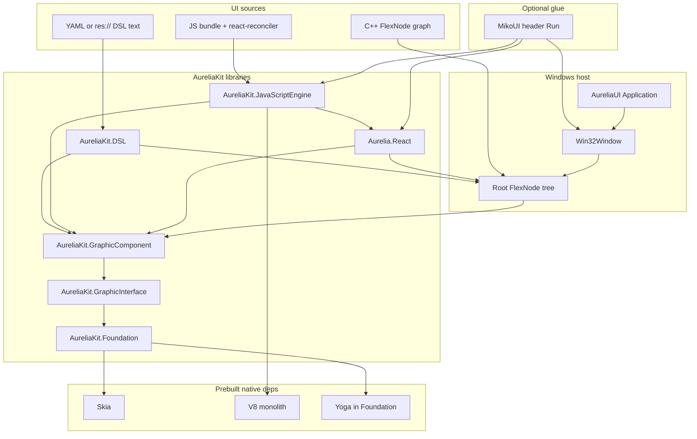
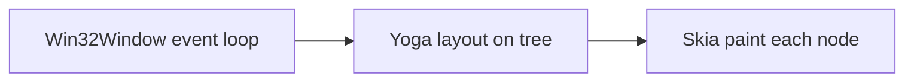

# AureliaKit — Work in Progress

> This project is currently under active development and is not yet stable.



---

## Architecture overview

High-level flow from **how you build UI** to **what runs at runtime**:



**Per-frame path** (simplified):



**Scripted UI** (optional): JavaScript runs in **V8** inside `AureliaKit.JavaScriptEngine`. Native code exposes `globalThis.AureliaUI` (`createNode`, `setStyle`, `setRoot`, …). **`Aurelia.React`** provides `RenderReactApp` which `eval`s your bundle and returns the `FlexNode` registered as root. The TypeScript host lives under `modules/reactui/`.

**Declarative UI**: **AUKDSL** (`YAML` or strings loaded from disk or `res://` via generated resources) parses into `DSLNode` objects attached under `GraphicComponent`.

---

## Documentation

- **[docs/README.md](docs/README.md)** — full index of Markdown guides.
- **MDX copies** for static-site generators: **[docs/mdx/](docs/mdx/index.mdx)**

---

## Platform Support

### Windows ✅

Recommended: **Visual Studio 2022** or newer (MSVC x64), **CMake**, **Ninja**, **Python 3**.

Build from the repo root:

```powershell
.\build.ps1
```

The script sources MSVC via `vcvars64`, regenerates theme headers, configures Ninja + Release if needed, and builds.

Prebuilts (Skia, optional V8) are downloaded or expected under `external/prebuilt/` — see [docs/BuildAndCI.md](docs/BuildAndCI.md).

---

### macOS / Linux ⚠️

Not yet available out of the box.
You must build the Skia render backend manually for cross-platform support.

Fetch Skia via:

```sh
git submodule update --init external/skia
```
