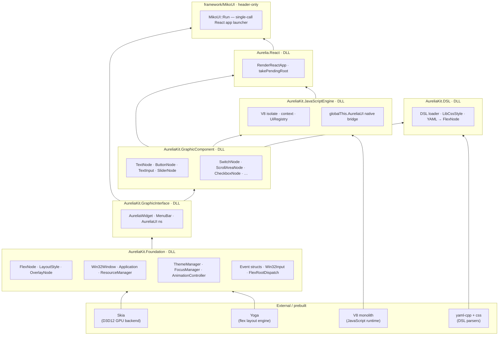
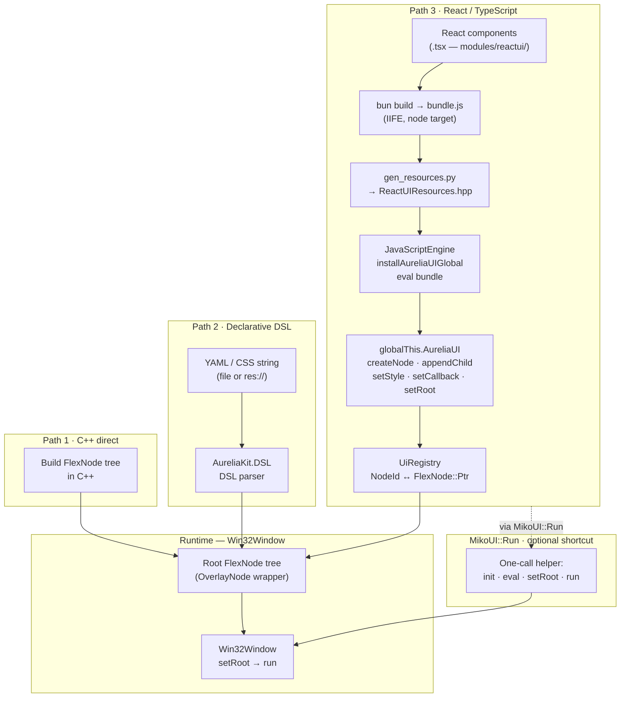
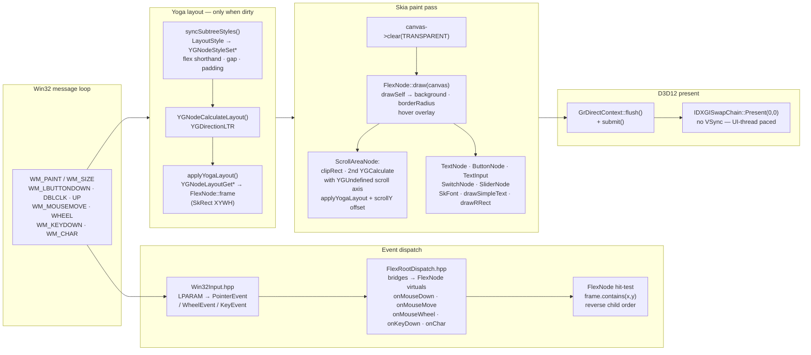
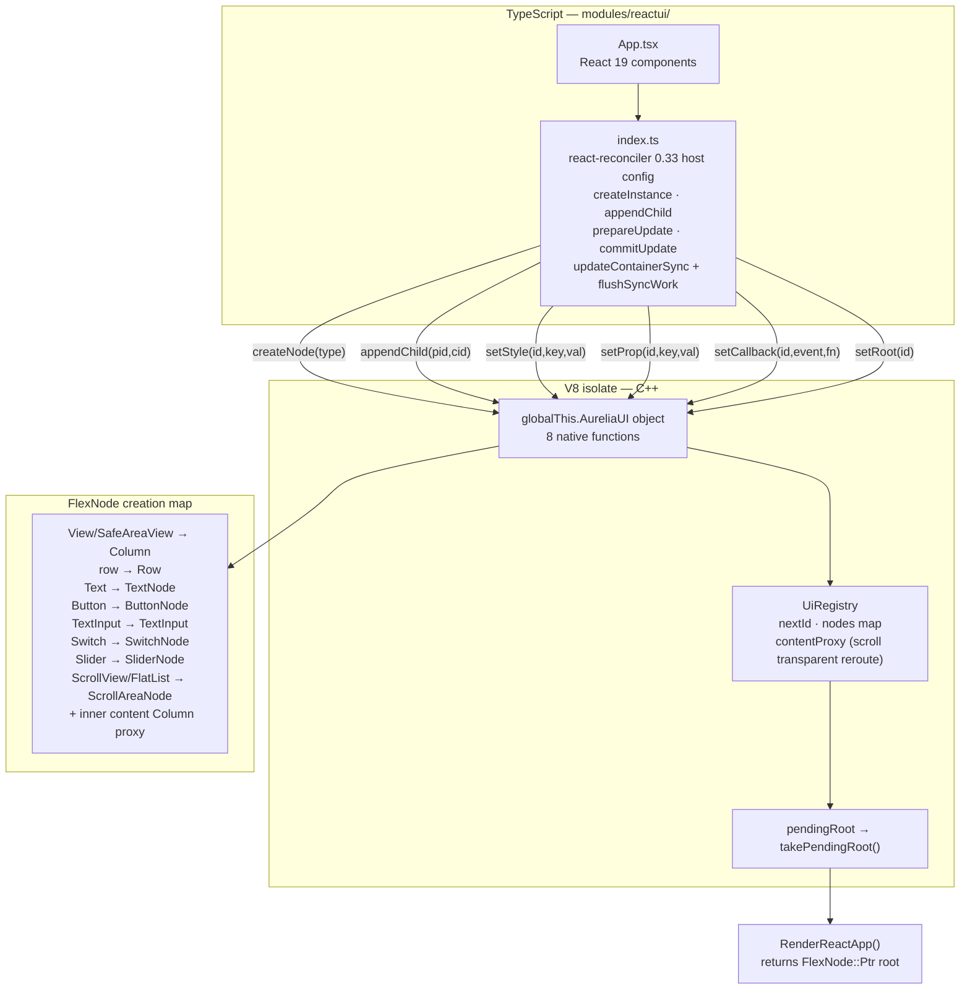

# AureliaKit — Work in Progress

> This project is currently under active development and is not yet stable.


---

## Architecture overview

### Library dependency graph



---

### Three UI authoring paths



---

### Per-frame rendering pipeline



---

### React / TypeScript bridge detail



**Scripted UI**: JavaScript runs in **V8** inside `AureliaKit.JavaScriptEngine`. The engine installs `globalThis.AureliaUI` before `eval`-ing the bundle. **`Aurelia.React`** wraps this in `RenderReactApp` which evaluates the bundle synchronously and returns the root `FlexNode`. The TypeScript reconciler host lives in `modules/reactui/index.ts` and uses `updateContainerSync` + `flushSyncWork` (reconciler 0.33 / React 19) for a single-pass synchronous render.

**Declarative UI**: **AUKDSL** accepts `YAML` or CSS-like strings, loaded from disk or `res://` URIs (embedded resources generated by `gen_resources.py`). It parses into a `FlexNode` sub-tree attached directly under the caller's container.

---

## Documentation

- **[docs/README.md](docs/README.md)** — full index of Markdown guides.
- **MDX copies** for static-site generators: **[docs/mdx/](docs/mdx/index.mdx)**

---

## Platform Support

### Windows ✅

Recommended: **Visual Studio 2022** or newer (MSVC x64), **CMake**, **Ninja**, **Python 3**.

Build from the repo root:

```powershell
.\build.ps1
```

The script sources MSVC via `vcvars64`, regenerates theme headers, configures Ninja + Release if needed, and builds.

Prebuilts (Skia, optional V8) are downloaded or expected under `external/prebuilt/` — see [docs/BuildAndCI.md](docs/BuildAndCI.md).

---

### macOS / Linux ⚠️

Not yet available out of the box.
You must build the Skia render backend manually for cross-platform support.

Fetch Skia via:

```sh
git submodule update --init external/skia
```
